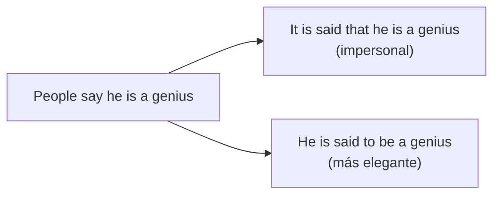

# C1 · Gramática 09 — Discurso Reportado Avanzado

> 🎯 **Objetivo:** ir más allá del reported speech básico (B1) hacia verbos introductorios matizados y estructuras de reporte propias de textos periodísticos y académicos.

## Más allá de "said" y "told": verbos con matiz

| Verbo | Matiz | Ejemplo |
|---|---|---|
| **claim** | afirmar (con duda implícita) | *He claimed to be innocent.* |
| **admit** | admitir (algo negativo) | *She admitted making a mistake.* |
| **deny** | negar | *He denied stealing the money.* |
| **acknowledge** | reconocer (formal) | *The report acknowledges the risks.* |
| **allege** | alegar (sin prueba, legal/periodístico) | *He is alleged to have lied.* |
| **imply** | insinuar | *She implied that he was wrong.* |
| **hint** | dar a entender indirectamente | *He hinted that changes were coming.* |
| **assert** | afirmar con firmeza | *The scientist asserted that the theory was correct.* |

## Estructuras pasivas de reporte (registro periodístico)

Muy comunes en noticias para reportar sin atribuir directamente:

> *It **is said that** he is a genius.*
> *He **is said to be** a genius.*
> *The company **is reported to have** lost millions.*
> *She **is believed to have** left the country.*

## Reportar con verbo + gerundio/infinitivo (sin "that")

| Estructura | Ejemplo |
|---|---|
| verbo + -ing | *He denied **stealing** the money.* |
| verbo + to + infinitivo | *She promised **to help**.* |
| verbo + objeto + to + infinitivo | *He advised **me to leave**.* |

## Reportar preguntas retóricas y exclamaciones (avanzado)

> Directo: *"How wonderful!"* → Indirecto: *She exclaimed that it was wonderful.*
> Directo: *"Why would anyone do that?"* → Indirecto: *He wondered why anyone would do that.*

## Práctica

1. Reescribe con "claim": *"He says he found the treasure, but no one believes him."*
2. Reescribe en pasiva de reporte: *"People believe she moved to Canada."*
3. Elige el verbo correcto (deny/admit): *"She ___ breaking the vase."* (lo admitió)

Ver respuestas

1. He claims to have found the treasure.
2. She is believed to have moved to Canada.
3. admitted

