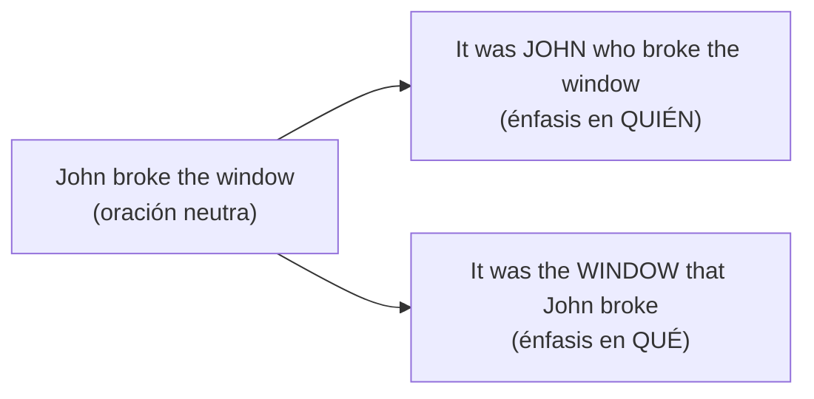

# C1 · Gramática 07 — Oraciones Hendidas (Cleft Sentences)

> 🎯 **Objetivo:** usar estructuras que dividen una oración en dos partes para dar énfasis a un elemento específico — un recurso muy usado en discurso persuasivo y escritura elegante.

Las cleft sentences "parten" una oración simple para resaltar una parte específica de la información.

## It-cleft: enfatizar un elemento

📌 **Estructura**: It + is/was + [elemento enfatizado] + that/who + resto de la oración

> Oración simple: *John broke the window.*
> Enfatizando el sujeto: ***It was John** who broke the window.*
> Enfatizando el objeto: ***It was the window** that John broke.*

## Wh-cleft (pseudo-cleft): con "what"

📌 **Estructura**: What + sujeto + verbo + is/was + [elemento enfatizado]

> Oración simple: *I need more time.*
> Con énfasis: ***What** I need **is** more time.*

> Oración simple: *This surprised me.*
> Con énfasis: ***What** surprised me **was** his reaction.*

## Comparación de impacto

| Neutra | Con énfasis (it-cleft) | Con énfasis (wh-cleft) |
|---|---|---|
| *She loves music.* | *It's music that she loves.* | *What she loves is music.* |
| *We need funding.* | *It's funding that we need.* | *What we need is funding.* |

## Uso en discurso persuasivo

Estas estructuras son comunes en discursos, ensayos y debates porque dirigen la atención del oyente:

> *It is **not** the money **that** motivates her — it's the challenge.*
> *What really matters **is** how we treat others.*

## Práctica

1. Convierte con it-cleft (enfatiza "Maria"): *"Maria organized the event."*
2. Convierte con wh-cleft: *"I want peace and quiet."*
3. Enfatiza el objeto: *"She wrote this book."* (enfatiza "this book")

Ver respuestas

1. It was Maria who organized the event.
2. What I want is peace and quiet.
3. It was this book that she wrote.

