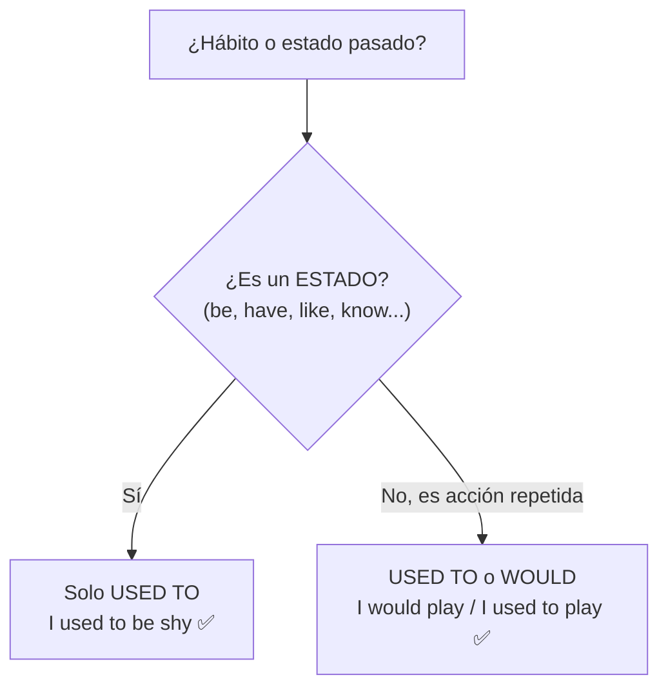

# B1 · Gramática 09 — Used to / Would (Hábitos Pasados)

> 🎯 **Objetivo:** hablar de hábitos y estados pasados que ya no ocurren, distinguiendo cuándo usar cada forma.

## Used to: hábitos y estados pasados

📌 **Estructura**: used to + verbo base

> *I **used to** play soccer every weekend.* (hábito, ya no lo hago)
> *She **used to** be shy.* (estado pasado, ya no)

✅ Funciona con **acciones repetidas** y también con **estados** (ser, tener, gustar).

## Would: solo hábitos, no estados

📌 **Estructura**: would + verbo base

> *When I was a child, I **would** play soccer every weekend.* ✅
> *I **would** be shy as a child.* ❌ (incorrecto: "be" es un estado)

## Negativo y preguntas (solo con used to)

| Afirmativo | Negativo | Pregunta |
|---|---|---|
| I used to smoke. | I **didn't use to** smoke. | **Did** you **use to** smoke? |

⚠️ Nota: en negativo/pregunta se quita la "d" de "used" → "use to".

## Diferencia con el presente

> *I **used to** live in Mexico. Now I live in Spain.* (contraste explícito con el presente)

## Práctica

1. Completa con used to o would (o ambos si aplica): *"When I was young, I ___ (climb) trees."*
2. Completa (solo un opción es correcta): *"She ___ (be) very quiet as a child."*
3. Convierte a negativo: *"I used to like vegetables."*

Ver respuestas

1. used to climb / would climb (ambos válidos)
2. used to be (estado, "would" no aplica)
3. I didn't use to like vegetables.

