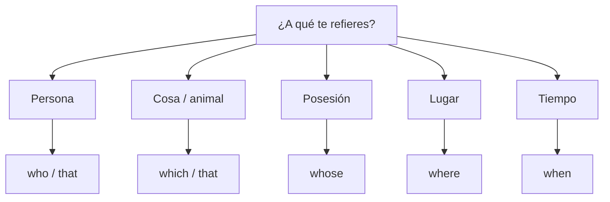

# B1 · Gramática 07 — Cláusulas Relativas (Relative Clauses)

> 🎯 **Objetivo:** unir dos ideas en una sola oración usando pronombres relativos, evitando repetir el sustantivo.

Las cláusulas relativas añaden información sobre un sustantivo sin empezar una oración nueva.

## Los pronombres relativos

| Pronombre | Se usa para | Ejemplo |
|---|---|---|
| **who** | personas | The man **who** called is my uncle. |
| **which** | cosas/animales | The book **which** I bought is great. |
| **that** | personas o cosas (informal) | The car **that** I drive is old. |
| **whose** | posesión | The girl **whose** dog barked is my neighbor. |
| **where** | lugares | The city **where** I was born is small. |
| **when** | tiempo | The day **when** we met was rainy. |

## Cláusulas definitorias (defining) vs no definitorias

📌 **Defining** (esenciales, sin comas): identifican de quién/qué hablamos.
> *The woman **who lives next door** is a doctor.*

📌 **Non-defining** (información extra, con comas): se puede quitar sin perder sentido.
> *My sister, **who lives in Canada**, is visiting us.*

⚠️ Con non-defining clauses **no se usa "that"**, solo who/which.

## Omitir el pronombre relativo

Cuando el pronombre es el **objeto** de la cláusula, se puede omitir:

> *The book (**that**) I bought is great.* (ambas son correctas)

Pero si es el **sujeto**, no se puede omitir:

> *The man **who** called is my uncle.* (no se puede quitar "who")

## Práctica

1. Une: *"This is the house. I grew up in it."*
2. Elige: *"The teacher ___ helped me is very kind."* (who/whose)
3. ¿Se puede omitir el relativo? *"The film (that) we watched was boring."*

Ver respuestas

1. This is the house where I grew up.
2. who
3. Sí, porque "that" es objeto de la cláusula.

