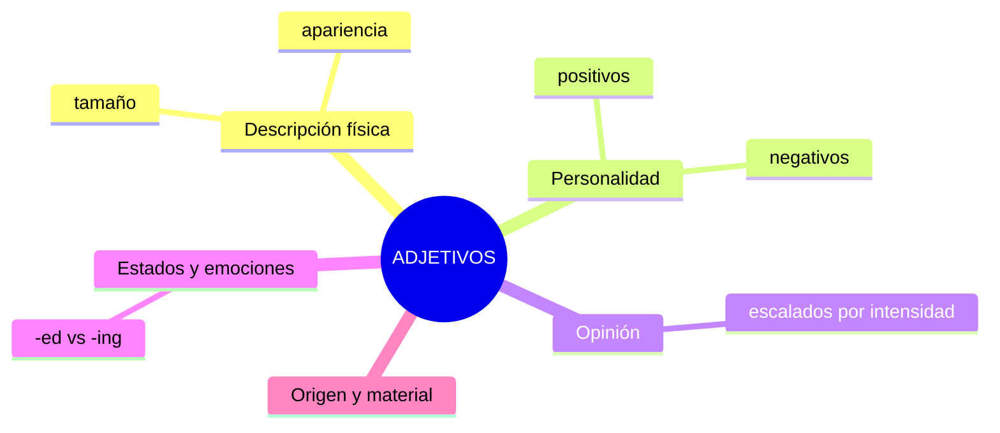

# EXTRA · Anexo 10 — Adjetivos: Vocabulario Completo por Tipo

> 📋 Los adjetivos describen sustantivos. Este anexo organiza el vocabulario de adjetivos por categoría, desde nivel básico hasta avanzado. (Para las reglas gramaticales de posición, orden y comparativos, ver A1-G04 y A2-G04.)

## Mapa de categorías

## 1. Descripción física (tamaño y forma)

| Inglés | Español |
|---|---|
| big / large | grande |
| small / little | pequeño |
| tall / short | alto / bajo |
| wide / narrow | ancho / angosto |
| thick / thin | grueso / delgado |
| round / square | redondo / cuadrado |

## 2. Personalidad (ver también B1-V01 para más detalle)

| Positivos | Negativos |
|---|---|
| kind, friendly, honest | rude, dishonest, selfish |
| confident, patient | arrogant, impatient |
| generous, reliable | stingy, unreliable |

## 3. Adjetivos de opinión, escalados por intensidad

Evita repetir siempre "good" o "bad" — escala según intensidad:

| Nivel | Positivo | Negativo |
|---|---|---|
| Suave | nice, fine | not great, poor |
| Neutro | good | bad |
| Fuerte | excellent, great | terrible, awful |
| Extremo | outstanding, superb | atrocious, dreadful |

## 4. Estados y emociones: adjetivos -ed vs -ing

| -ed (cómo se siente alguien) | -ing (qué causa el sentimiento) |
|---|---|
| bored | boring |
| interested | interesting |
| excited | exciting |
| surprised | surprising |
| tired | tiring |
| confused | confusing |

> *I am **bored**.* (yo siento aburrimiento) vs *This movie is **boring**.* (la película causa aburrimiento)

## 5. Origen y material

| Inglés | Español |
|---|---|
| wooden | de madera |
| metal / metallic | metálico |
| plastic | de plástico |
| Mexican, French, Japanese... | mexicano, francés, japonés... |

## 6. Orden de adjetivos múltiples (repaso)

> **Cantidad → Opinión → Tamaño → Edad → Forma → Color → Origen → Material → Sustantivo**

> *A **beautiful small old round white French wooden** table.*

## Práctica

1. Escala hacia arriba: *good → ? → ?*
2. Escala hacia abajo: *bad → ? → ?*
3. Elige correcto: *"I am (bored/boring) of this class."*

Ver respuestas

1. good → great → excellent/outstanding
2. bad → poor → terrible/awful
3. bored

