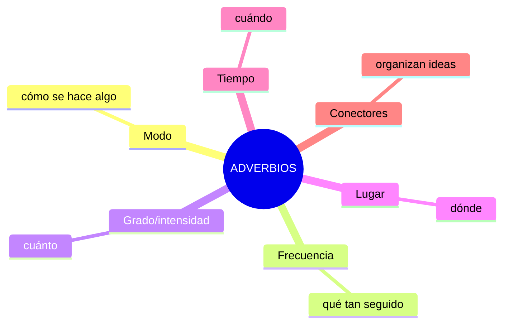

# EXTRA · Anexo 11 — Adverbios: Vocabulario Completo por Tipo

> 📋 Los adverbios modifican verbos, adjetivos u otros adverbios. Este anexo organiza el vocabulario por tipo. (Para reglas de posición en la oración, ver A1-G04.)

## Mapa de tipos

## 1. Adverbios de modo (cómo)

Se forman generalmente agregando **-ly** al adjetivo.

| Adjetivo | Adverbio |
|---|---|
| quick | quickly |
| careful | carefully |
| slow | slowly |
| happy | happily (cambia "y" → "i") |
| easy | easily |

⚠️ **Irregulares**: *good → well* (no "goodly"), *fast → fast*, *hard → hard*.

> *She sings **beautifully**.* / *He drives **carefully**.*

## 2. Adverbios de frecuencia (qué tan seguido)

| Adverbio | % aproximado |
|---|---|
| always | 100% |
| usually | 80% |
| often | 60% |
| sometimes | 40% |
| rarely / seldom | 20% |
| never | 0% |

🔸 Van **antes** del verbo principal, pero **después** de "to be": *She **is always** late.* / *She **always arrives** late.*

## 3. Adverbios de grado/intensidad (cuánto)

| Adverbio | Intensidad |
|---|---|
| slightly | ligeramente |
| fairly / rather | bastante |
| quite | bastante / considerablemente |
| very | muy |
| extremely | extremadamente |
| absolutely | absolutamente (con adjetivos extremos: *absolutely amazing*) |

> *It's **slightly** cold.* / *That's **absolutely** brilliant!*

## 4. Adverbios de lugar (dónde)

| Inglés | Español |
|---|---|
| here / there | aquí / allí |
| everywhere | en todas partes |
| nowhere | en ningún lugar |
| abroad | en el extranjero |
| upstairs / downstairs | arriba / abajo |

## 5. Adverbios de tiempo (cuándo)

| Inglés | Español |
|---|---|
| now | ahora |
| soon | pronto |
| yesterday / today / tomorrow | ayer / hoy / mañana |
| already | ya |
| still | todavía |
| yet | todavía / aún (en negativo/pregunta) |

🔸 **Already vs yet**: *already* en afirmativo (*I've already eaten*); *yet* en negativo/pregunta (*I haven't eaten yet* / *Have you eaten yet?*)

## 6. Adverbios conectores (organizan ideas — repaso de A2/B2)

| Adverbio | Función |
|---|---|
| however | contraste |
| therefore | consecuencia |
| moreover | añadir |
| meanwhile | mientras tanto |

## Práctica

1. Adverbio de "good": ?
2. Ordena por frecuencia de mayor a menor: *sometimes, always, rarely, usually*
3. Elige: *"I haven't finished ___ (already/yet)."*

Ver respuestas

1. well
2. always, usually, sometimes, rarely
3. yet

